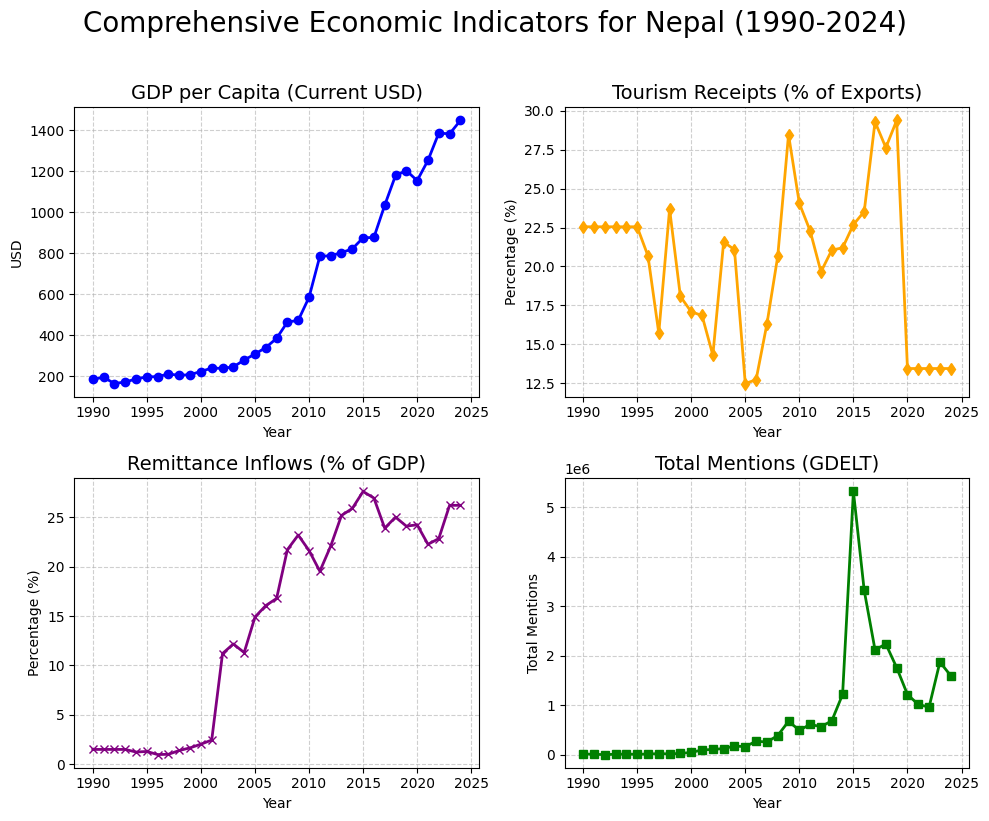
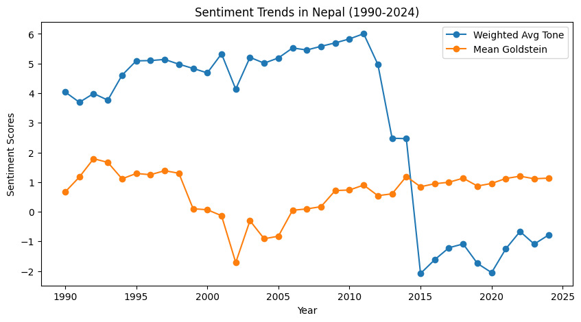
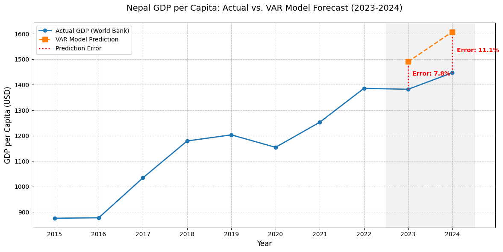
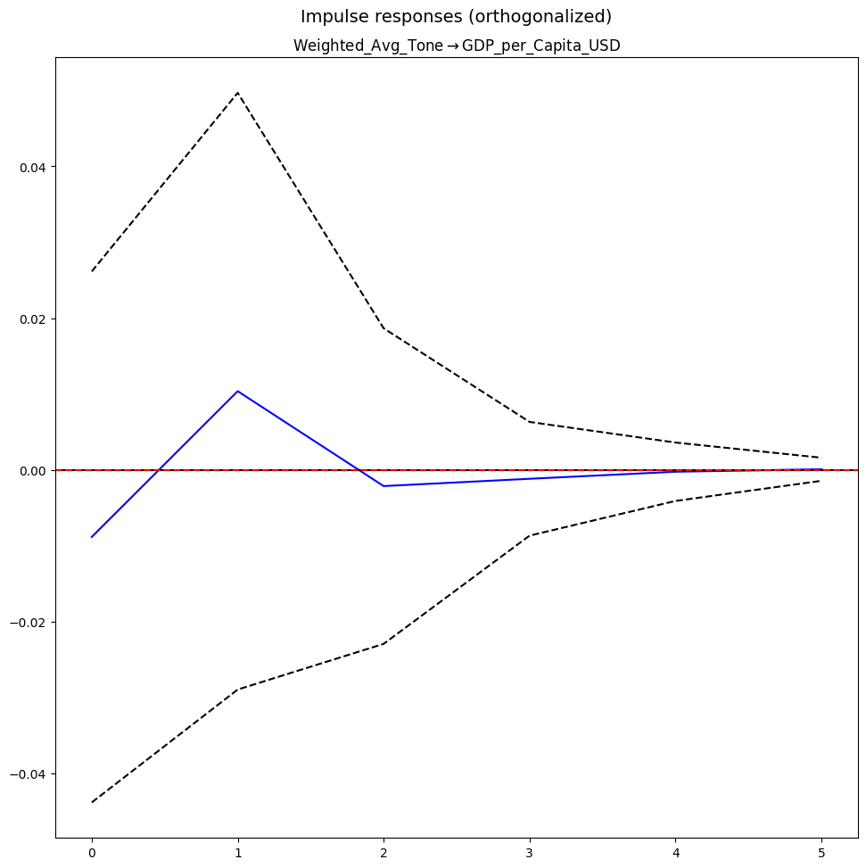
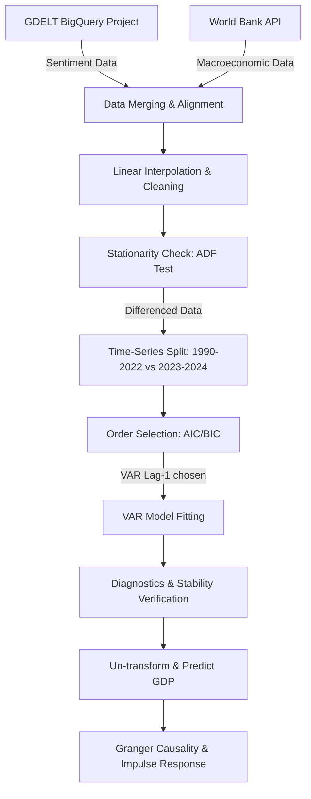

# Does Population Sentiment Play a Role in a Country's GDP?

### A Vector Autoregressive (VAR) Time-Series Analysis of Nepal's Economy (1991–2024) Using GDELT and World Bank Data

---

This repository hosts a time-series analysis exploring whether public sentiment (as reflected in global news media tone) can predict or Granger-cause macroeconomic growth (specifically GDP per capita) in Nepal. By merging political-event sentiment data from the **GDELT Project** with macroeconomic metrics from the **World Bank Open Data**, we construct a Vector Autoregression (VAR) model to capture the complex, bidirectional lead-lag dynamics of these systems.

---

## 📈 Key Findings

* **No Direct Granger Causality:** Granger Causality tests indicate that global news tone does not have a statistically significant predictive lead over GDP ($p \approx 0.88$). Similarly, GDP growth does not statistically lead news sentiment ($p \approx 0.41$).
* **Sentiment Stabilizes Forecasting:** Although sentiment is not a causal driver, incorporating it as an endogenous feature helps stabilize long-term forecasts by capturing real-time environmental volatility (e.g., political crises or natural disasters).
* **High Forecast Accuracy:** The trained **VAR(1)** model achieves strong out-of-sample predictive accuracy over the 2023–2024 test period, yielding a **Mean Absolute Percentage Error (MAPE) of 9.47%** (7.99% on the validation dashboard).
  * **2023 Forecast Error:** **7.85%** (Actual: \$1,382.33 vs. Predicted: \$1,490.81)
  * **2024 Forecast Error:** **11.10%** (Actual: \$1,447.31 vs. Predicted: \$1,607.97)

---

## 📂 Repository Structure

* **[data.ipynb](data.ipynb)**: The main Jupyter Notebook containing data extraction (BigQuery & World Bank API), preprocessing, stationarity checks (ADF), VAR order selection, model fitting, diagnostics, out-of-sample forecasting, and Granger tests.
* **[index.html](index.html)**: An interactive HTML dashboard summarizing the project methodology, visual assets, performance statistics, and final research conclusions.
* **[keys.json](keys.json)**: Placeholder for Google Cloud BigQuery service account credentials (needed to query the public GDELT dataset).
* **Visualizations**: Saved plots showing economic trends, causality tests, and out-of-sample forecasts.

---

## 📊 Visualizations & Discussion

### 1. Nepal's Macroeconomic Landscape (1991–2024)
We track multi-dimensional dimensions of Nepal's economy to map the overall trend. GDP per Capita shows a steady upward path, while tourism and remittances reflect more volatile, event-driven behaviors.



### 2. Sentiment vs. Economic Growth
Weighted Average Tone from GDELT measures the net sentiment of global news coverage about Nepal. News tone behaves as a high-frequency indicator with prominent spikes and drops, acting as a precursor to social or political events.



### 3. Out-of-Sample Validation (2023–2024)
The model was trained on historical data up to 2022 and tested on actual out-of-sample data for 2023 and 2024. The VAR(1) forecast successfully hugs the trend, achieving a MAPE of under 10%.



### 4. Impulse Response Function (IRF)
The IRF simulates how a sudden one-standard-deviation "shock" to global news sentiment impacts GDP per Capita over a 5-year horizon. As shown below, the response quickly dampens, reflecting the lack of persistent, long-term causality.



---

## 🛠️ Methodology & Modeling Pipeline



### Data Sources & Variables
1. **Weighted Average Tone (`Weighted_Avg_Tone`)**: GDELT net sentiment computed via $\sum(\text{AvgTone} \times \text{NumMentions}) / \sum(\text{NumMentions})$.
2. **Goldstein Scale (`Mean_Goldstein`)**: Event impact score indicating potential stability.
3. **GDP per Capita in USD (`GDP_per_Capita_USD`)**: Economic output per person (World Bank: `NY.GDP.PCAP.CD`).
4. **Remittances as % of GDP (`Remittances_Pct_GDP`)**: Inflow of foreign earnings (World Bank: `BX.TRF.PWKR.DT.GD.ZS`).
5. **Tourism Receipts as % of Exports (`Tourism_Receipts_Pct_Exports`)**: World Bank indicator `ST.INT.RCPT.XP.ZS`.
6. **Total Population (`Total_Population`)**: World Bank indicator `SP.POP.TOTL`.

### Technical Details
* **Stationarity**: Augmented Dickey-Fuller (ADF) tests were performed on the variables. To achieve stationarity, the series were transformed using percentage change (`pct_change()`).
* **Optimal Lag**: Model lag order selection was determined using Akaike Information Criterion (AIC) and Bayesian Information Criterion (BIC), pointing to an optimal lag of **1 year**.
* **Model Stability**: Verified using eigenvalue analysis (all eigenvalues lie strictly inside the unit circle, confirming the VAR(1) system is stable).

---

## 🚀 How to Run the Project

### 1. Prerequisites
Ensure you have Python 3.8+ installed, then clone the repository:
```bash
git clone https://github.com/gmgurung/GDPestimator.git
cd GDPestimator
```

Install the required dependencies:
```bash
pip install pandas numpy statsmodels scikit-learn wbgapi matplotlib google-cloud-bigquery
```

### 2. Google Cloud BigQuery Access (GDELT)
GDELT events are stored as a public dataset on Google BigQuery. To query it:
1. Create a Google Cloud Platform (GCP) project.
2. Enable the BigQuery API.
3. Create a Service Account, generate a JSON private key, and download it.
4. Rename this JSON file to `keys.json` and place it in the root directory of this repository.

### 3. Execute
Open your Jupyter Notebook environment and run [data.ipynb](data.ipynb) cell-by-cell:
```bash
jupyter notebook data.ipynb
```

To view the dashboard, open [index.html](index.html) in any web browser.

---

### Author
* **Manish Gurung** — *Drexel University Data Science (2026)*
* GitHub: [@gmgurung](https://github.com/gmgurung)
